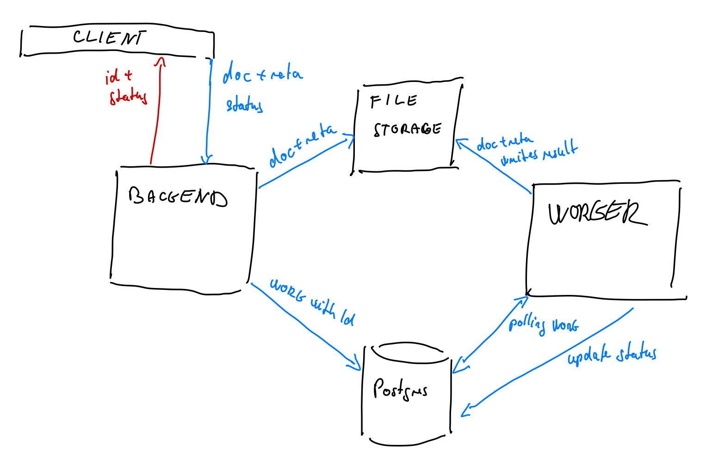

# Architecture overview
The following architecture for the PoC phase of the project was designed to be as simple as possible 
as well as reasonably performant.

## Services
The project is split into following services:
1. Backend
1. Worker
1. Database
1. File Storage

### Backend
Asynchronous REST API service is responsible for the following tasks:
1. Authenticating and authorizing the requests.
1. Receiving the OCR job requests from the clients - including the documents and the metadata.
1. Providing the information of the job's status, when asked by the client.
1. Providing the result of the job, when asked by the client.

When the service receives new document, the flow is as follows:
1. Generate `uuid` for the OCR job.
1. Create folder in `File Storage` with `uuid` as a name of the folder.
1. Upload the received document and the metadata to newly created folder in `File Storage`.
1. Create record in the database for the job with `uuid` and status `QUEUED`.
1. Respond to client with `uuid` and the `status=QUEUED`.

The client is then responsible for picking the result up by calling the `Backend` data endpoint with the job's `uuid`.
1. The client calls `Backend` with request for the result of the OCR job.
1. `Backend` checks whether the job has `status=FINISHED`, if not returns [HTTP 202](https://www.w3.org/Protocols/rfc2616/rfc2616-sec10.html#sec10.2.3) 
status code.
1. If the job has `status=FINISHED` the `Backend` generates redirect HTTP link for the result file
(either to itself as a proxy for file storage or as [MinIO](https://min.io/) shareable link) and returns the link
to client with status code [302](https://developer.mozilla.org/en-US/docs/Web/HTTP/Redirections)

> Thanks to this redirect, the traffic inside the system - between the microservices - is significantly reduced.

The implementation in the PoC should be in Python in order not to duplicate the database access layer
and the DTOs.

#### Synchronous Access
The service can possibly provide other means of the result access then client polling.
Two other access options can be implemented easily as an extension of this service:

1. Busy waiting directly on the HTTP request from the client and providing the job result in the single request
by polling the database and waiting on the `status=FINISHED` before responding with the OCR result.
1. Websockets streaming - the inner implementation is the same as in `1.` but with websockets.

### Worker
Responsible for the OCR itself, it is expected to be the most performance demanding service.
The worker periodically checks (by simple polling and busy waiting)
whether there are new jobs in the `Database` with status `QUEUED`. 
If there are some such jobs, it picks them up and changes their status to `IN_PROGRESS`.

> **Note** that such operation - check and potential status update - must be atomic, thus the worker 
 must lock the table first, check whether there are any jobs with `QUEUED` status, select the oldest one,
 change the status to `IN_PROGRESS` and then unlock the table.

When the job is picked up, the OCR algorithm is executed and the produced data are then written to the 
`File Storage`.

In other words, the flow is as follows:

1. Lock the database table and check if there are jobs with `QUEUED` status in the `Database`.
1. If not, unlock the table and wait for some time and go to 1.
1. Change the status of the job to `IN_PROGRESS` and unlock the table.
1. Download the document and the metadata from the `File Storage` in the job's `uuid` folder.
1. Start OCR algorithm.
1. Once finished, upload the result to the `File Storage` to the job's `uuid` folder.
1. Change the status in `Database` to `FINISHED`.

The implementation should be Python in the PoC phase, if the performance rewrite is needed,
then C++ or Rust.

### File Storage
The purpose of this service is to store the original documents from the clients, 
the received metadata and finally, when the worker finished its work, the translated document.
All data for one request (document, metadata, final text) should be stored in the one folder under 
`uuid` of the task - this `uuid` is generated by the `Backend` service during the OCR request.

The implementation can be either shared volume in the docker or [MinIO](https://min.io/) if possible.

### Database
Single source of truth for the system. The database contains structured data about the state of the system.
Apart from the information about the users of the system it holds following tables related to the system function.

Job:
- `uuid` - UUID generated by the `Backend`
- `user_id` - id of the user who requested the job

Job Status Transitions (multiple records for single job, one for each job status name):
- `job_uuid` - id reference of `Job`
- `status` - job status `QUEUED`, `IN_PROGRESS`, `FINISHED`, `FAILURE`, indicating the status of the job at `timestamp`
- `timestamp` - timestamp when the job status changed to `status`

The job is always in the `status` which has the most recent `timestamp`.

## Scaling 
This architecture was designed for one OCR job at a time, but can be easily extended to scale more
by introducing a `Worker Dispatcher` - which can serve as a middle layer between the `Database` and the `Worker`.
The main purpose of the `Worker Dispatcher` would be to pick up the jobs from the `Database`, schedule their execution
on hardware resources (Kubernetes Nodes, Lambdas, other VMs) and then start the `Worker` with correct parameters.
